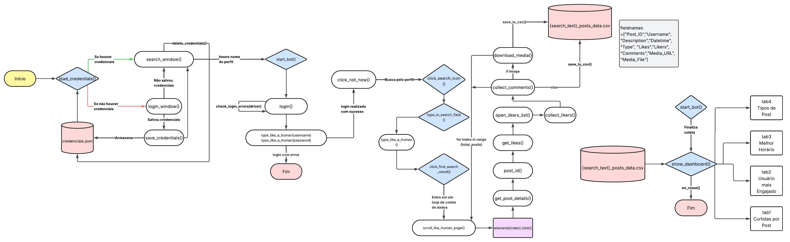

# Projeto Trabalho de Diplomação 

Este projeto utiliza o Selenium WebDriver para automação de navegação no navegador Chrome. 
> **Aviso:** Este projeto é de caráter educacional. O uso de automação em plataformas como o Instagram deve seguir os termos de uso da plataforma.

# Requisitos
## Como Configurar o Ambiente

1. **Navegador (Chrome ou Chromium)**:
   - **Windows**: Certifique-se de que o **Google Chrome** está instalado no seu computador. Caso não tenha, baixe [aqui](https://www.google.com/chrome/).
   - **Linux**: Você pode usar o **Chromium**, que é uma versão open source do Chrome. Para instalar, use o gerenciador de pacotes da sua distribuição:
     - Debian/Ubuntu:
       ```bash
       sudo apt install chromium-browser
       ```
     - Fedora:
       ```bash
       sudo dnf install chromium
       ```
     - Arch Linux:
       ```bash
       sudo pacman -S chromium
       ```

2. **Python 3.x**:
Se o Python não estiver instalado, siga os passos abaixo:
   - Baixe e instale pela página oficial: [https://www.python.org/downloads/](https://www.python.org/downloads/)
   - Durante a instalação no Windows, **marque a opção “Add Python to PATH”**.
    - Após a instalação, abra o PowerShell ou o prompt de comando e digite:

    
   ```bash
     python --version
   ```
     ou
   
   ```bash
     py --version  # no Windows
   ```


### 3. Instalar as dependências

Com o Python instalado, vamos instalar as bibliotecas necessárias. No seu terminal, execute o seguinte comando:

```bash
pip install selenium webdriver-manager python-dotenv pandas matplotlib pillow
```

Caso desejar verificar se foram instalados corretamente:
```bash
py -m pip list
```

---

### Segurança:

Certifique-se de **não compartilhar o arquivo `credenciais.json`** publicamente. Ele contém informações sensíveis como sua senha e nome de usuário, que podem ser usadas de maneira indevida se caírem em mãos erradas.

---

## Como Executar

1. Certifique-se de ter o Python instalado e as dependências configuradas.
2. Tenha em mãos suas credenciais de login do Instagram (usuário/email e senha).
3. No terminal, execute:

```bash
python main.py
# ou
py main.py
```

## Uso da Interface Gráfica 

>  Ao executar o programa, uma **interface gráfica** será aberta, permitindo inserir suas credenciais e definir o alvo da coleta. 

### Tela de Login 

1. Na **primeira página**, serão exibidos dois campos para preenchimento:

   * **Usuário ou E-mail**
   * **Senha**


* Você pode optar por: 
  * **Exibir ou ocultar sua senha**.
  * **Salvar as credenciais** para que, nas próximas execuções, o programa utilize automaticamente esse login (opcional).

2. Após preencher os campos, clique em **"Continuar"**.


---

###  Tela de Pesquisa (Alvo da Coleta) 
* Na sequência, será exibido o campo para inserir o **nome de usuário do Instagram** que será alvo da coleta de dados.


* Digite o nome do perfil (sem `@`) e clique em **"Pesquisar"** para iniciar o processo de web scraping. 
---
## Execução do código (Coletando dados...)

Neste caso agora, seria aguardar o código realizar o scraping.


---

## Dashboard de Análise de Engajamento no Instagram


### Curtidas por Post

Apresenta a distribuição do número de curtidas em cada publicação analisada. 

### Usuário Mais Engajado

Identifica o perfil que mais interagiu (curtidas e comentários) com o conteúdo do perfil analisado. 

### Melhor Horário para Postar

Indica os horários em que as publicações tendem a gerar maior engajamento. 

### Tipos de Post

Classificação das postagens por tipo (imagem, vídeo), com base na frequência e engajamento. 

---

##  Estrutura de Arquivos

```plaintext
├── /imagens               # Pasta onde são salvos as imagens extraídas
├── main.py                # Arquivo principal
├── credenciais.json       # Arquivo com suas credenciais (NÃO COMPARTILHE)
├── README.md              # Este arquivo
```

##  Fluxograma Completo do funcionamento do código


